+++
title = "AirBnB Price Analysis"
subtitle = ""

# Add a summary to display on homepage (optional).
summary = " A quick analysis of Airbnb prices for London 2009-2019"

date = 2019-05-25T17:55:02+01:00
draft = false

# Authors. Comma separated list, e.g. `["Bob Smith", "David Jones"]`.
authors = ["MrRutledge-2KM"]

# Is this a featured post? (true/false)
featured = false

# Tags and categories
# For example, use `tags = []` for no tags, or the form `tags = ["A Tag", "Another Tag"]` for one or more tags.
tags = ["AirBnB"]
categories = ["Jupyter Notebook"]

# Projects (optional).
#   Associate this post with one or more of your projects.
#   Simply enter your project's folder or file name without extension.
#   E.g. `projects = ["deep-learning"]` references 
#   `content/project/deep-learning/index.md`.
#   Otherwise, set `projects = []`.
# projects = ["internal-project"]

# Featured image
# To use, add an image named `featured.jpg/png` to your page's folder. 
[image]
  # Caption (optional)
  caption = ""

  # Focal point (optional)
  # Options: Smart, Center, TopLeft, Top, TopRight, Left, Right, BottomLeft, Bottom, BottomRight
  focal_point = ""
+++

# Airbnb Hosting Prices analysis?

### In this notebook, we'll walk through the basics of exploring your data including: 
- importing data
- understanding data
- transforming data
- visualising data

First things first, we'll import the python libraries we'll need:

Data used.

The data used in this Notebook was provided by a company called [Count](https://count.co), they run [OpendataHackathon ](https://www.meetup.com/London-Open-Data-Hackathons/)Meetpup Sessions in London. 


```python
import pandas as pd             # data maniuplation
import numpy as np              # numerical libraries
import os                       # operating-system specifics
import matplotlib.pyplot as plt
plt.rcParams["figure.figsize"] = (10,7)
import seaborn as sns           # fancy stylesheet over matplotlib
plt.style.use(['seaborn','dark_background'])
```


```python
%load_ext autoreload
%autoreload 2
%matplotlib inline
import warnings
warnings.filterwarnings('ignore')
warnings.filterwarnings(action="ignore", message="^internal gelsd")
```

... and list the `.csv` files we have access to in the `Data` folder. The [os library](https://docs.python.org/3/library/os.html) allows you standardize the way you go through your file directory so it won't matter if you're on a mac or a PC.


```python
path = os.path.join("..","Data")
[f for f in os.listdir(path) if f.endswith(".csv")]
```


    [
     'Calendar.csv',
     'Hosts.csv',
     'HousePrices.csv',
     'Listings.csv',
     'Reviews.csv',
     'SAF_Crimes_08-17.csv']


## Getting to grips with the data

To get a feel for what's in a dataframe, use the `head()` function, e.g.


```python
listings = pd.read_csv(os.path.join(path,"Listings.csv"))
housePrices = pd.read_csv(os.path.join(path,"HousePrices.csv"))
hosts = pd.read_csv(os.path.join(path,"Hosts.csv"))
calendar = pd.read_csv(os.path.join(path,"Calendar.csv"))
reviews = pd.read_csv(os.path.join(path,"Reviews.csv"))
```


```python
print('Listings Shape :', listings.shape)
print('housePrices :', housePrices.shape)
print('hosts :', hosts.shape)
print('calendar:', calendar.shape)
print('reviews :', reviews.shape) 
```

    Listings Shape : (103546, 36)
    housePrices : (891, 14)
    hosts : (63544, 13)
    calendar: (1853374, 6)
    reviews : (617805, 6)
    

To get some summary statistics about each of the columns in the dataframe, use the `describe()` function.


```python
listings.describe()
```


<div>
<style scoped>
    .dataframe tbody tr th:only-of-type {
        vertical-align: middle;
    }

    .dataframe tbody tr th {
        vertical-align: top;
    }

    .dataframe thead th {
        text-align: right;
    }
</style>
<table border="1" class="dataframe">
  <thead>
    <tr style="text-align: right;">
      <th></th>
      <th>id</th>
      <th>host id</th>
      <th>latitude</th>
      <th>longitude</th>
      <th>accommodates</th>
      <th>bathrooms</th>
      <th>bedrooms</th>
      <th>beds</th>
      <th>minNights</th>
      <th>maxNights</th>
      <th>reviewCount</th>
      <th>review rating</th>
      <th>review accuracy</th>
      <th>review cleanliness</th>
      <th>review checkin</th>
      <th>review communication</th>
      <th>review location</th>
      <th>review value</th>
      <th>guests included</th>
    </tr>
  </thead>
  <tbody>
    <tr>
      <th>count</th>
      <td>1.035460e+05</td>
      <td>1.035460e+05</td>
      <td>103546.000000</td>
      <td>103546.000000</td>
      <td>103546.000000</td>
      <td>103332.000000</td>
      <td>103480.000000</td>
      <td>103376.000000</td>
      <td>103546.000000</td>
      <td>1.035460e+05</td>
      <td>103546.000000</td>
      <td>73882.000000</td>
      <td>73785.000000</td>
      <td>73813.000000</td>
      <td>73698.000000</td>
      <td>73787.000000</td>
      <td>73690.000000</td>
      <td>73684.000000</td>
      <td>103546.000000</td>
    </tr>
    <tr>
      <th>mean</th>
      <td>1.860240e+07</td>
      <td>6.811356e+07</td>
      <td>51.509675</td>
      <td>-0.127843</td>
      <td>3.180557</td>
      <td>1.286523</td>
      <td>1.397198</td>
      <td>1.747688</td>
      <td>3.758272</td>
      <td>5.834671e+04</td>
      <td>14.560823</td>
      <td>92.270864</td>
      <td>9.471871</td>
      <td>9.239064</td>
      <td>9.602092</td>
      <td>9.638961</td>
      <td>9.461759</td>
      <td>9.246458</td>
      <td>1.553290</td>
    </tr>
    <tr>
      <th>std</th>
      <td>8.733189e+06</td>
      <td>6.732846e+07</td>
      <td>0.045636</td>
      <td>0.091573</td>
      <td>2.002515</td>
      <td>0.601339</td>
      <td>0.915355</td>
      <td>1.260421</td>
      <td>13.606510</td>
      <td>1.007425e+07</td>
      <td>31.232065</td>
      <td>10.454360</td>
      <td>1.017013</td>
      <td>1.168182</td>
      <td>0.932985</td>
      <td>0.911308</td>
      <td>0.875098</td>
      <td>1.055188</td>
      <td>1.270976</td>
    </tr>
    <tr>
      <th>min</th>
      <td>9.554000e+03</td>
      <td>5.160000e+02</td>
      <td>51.289812</td>
      <td>-0.509800</td>
      <td>0.000000</td>
      <td>0.000000</td>
      <td>0.000000</td>
      <td>0.000000</td>
      <td>1.000000</td>
      <td>1.000000e+00</td>
      <td>0.000000</td>
      <td>20.000000</td>
      <td>2.000000</td>
      <td>2.000000</td>
      <td>2.000000</td>
      <td>2.000000</td>
      <td>2.000000</td>
      <td>2.000000</td>
      <td>1.000000</td>
    </tr>
    <tr>
      <th>25%</th>
      <td>1.251873e+07</td>
      <td>1.310693e+07</td>
      <td>51.486150</td>
      <td>-0.187520</td>
      <td>2.000000</td>
      <td>1.000000</td>
      <td>1.000000</td>
      <td>1.000000</td>
      <td>1.000000</td>
      <td>3.100000e+01</td>
      <td>0.000000</td>
      <td>90.000000</td>
      <td>9.000000</td>
      <td>9.000000</td>
      <td>9.000000</td>
      <td>10.000000</td>
      <td>9.000000</td>
      <td>9.000000</td>
      <td>1.000000</td>
    </tr>
    <tr>
      <th>50%</th>
      <td>1.993665e+07</td>
      <td>4.016090e+07</td>
      <td>51.513804</td>
      <td>-0.125415</td>
      <td>2.000000</td>
      <td>1.000000</td>
      <td>1.000000</td>
      <td>1.000000</td>
      <td>2.000000</td>
      <td>1.125000e+03</td>
      <td>3.000000</td>
      <td>95.000000</td>
      <td>10.000000</td>
      <td>10.000000</td>
      <td>10.000000</td>
      <td>10.000000</td>
      <td>10.000000</td>
      <td>9.000000</td>
      <td>1.000000</td>
    </tr>
    <tr>
      <th>75%</th>
      <td>2.484513e+07</td>
      <td>1.162400e+08</td>
      <td>51.536790</td>
      <td>-0.070150</td>
      <td>4.000000</td>
      <td>1.500000</td>
      <td>2.000000</td>
      <td>2.000000</td>
      <td>3.000000</td>
      <td>1.125000e+03</td>
      <td>15.000000</td>
      <td>100.000000</td>
      <td>10.000000</td>
      <td>10.000000</td>
      <td>10.000000</td>
      <td>10.000000</td>
      <td>10.000000</td>
      <td>10.000000</td>
      <td>2.000000</td>
    </tr>
    <tr>
      <th>max</th>
      <td>3.288463e+07</td>
      <td>2.473889e+08</td>
      <td>51.686817</td>
      <td>0.317520</td>
      <td>16.000000</td>
      <td>17.000000</td>
      <td>44.000000</td>
      <td>23.000000</td>
      <td>1125.000000</td>
      <td>2.147484e+09</td>
      <td>614.000000</td>
      <td>100.000000</td>
      <td>10.000000</td>
      <td>10.000000</td>
      <td>10.000000</td>
      <td>10.000000</td>
      <td>10.000000</td>
      <td>10.000000</td>
      <td>24.000000</td>
    </tr>
  </tbody>
</table>
</div>


```python
listings.info()
```

    <class 'pandas.core.frame.DataFrame'>
    RangeIndex: 103546 entries, 0 to 103545
    Data columns (total 36 columns):
    id                          103546 non-null int64
    last scraped                103546 non-null object
    listing url                 103546 non-null object
    name                        103508 non-null object
    host id                     103546 non-null int64
    experiences                 103546 non-null object
    neighbourhood               103546 non-null object
    latitude                    103546 non-null float64
    longitude                   103546 non-null float64
    property type               103546 non-null object
    room type                   103546 non-null object
    accommodates                103546 non-null int64
    bathrooms                   103332 non-null float64
    bedrooms                    103480 non-null float64
    beds                        103376 non-null float64
    bed type                    103546 non-null object
    minNights                   103546 non-null int64
    maxNights                   103546 non-null int64
    reviewCount                 103546 non-null int64
    instant bookable            103546 non-null object
    is business travel ready    103546 non-null object
    cancellation policy         103546 non-null object
    first review                76102 non-null object
    last review                 76120 non-null object
    review rating               73882 non-null float64
    review accuracy             73785 non-null float64
    review cleanliness          73813 non-null float64
    review checkin              73698 non-null float64
    review communication        73787 non-null float64
    review location             73690 non-null float64
    review value                73684 non-null float64
    price                       103546 non-null object
    security deposit            65673 non-null object
    cleaning fee                74480 non-null object
    guests included             103546 non-null int64
    extra people                103546 non-null object
    dtypes: float64(12), int64(7), object(17)
    memory usage: 28.4+ MB
    

A common pitfall when first using `pandas` arises from the column typings. Python is a dynamically-typed language, which means you often don't explictly see the type of a variable you are working with. Note that it is still strongly-typed though:

Although the types aren't specified by the user, they are inferred by the language runtime and their behaviour is dictated accordingly. Contrast this to dynamic and *weakly-typed* languages like javascript, which will happily allow the addition of numbers and strings.

To get the data types (`dtypes`) of your columns, use the `dtypes` property of a dataframe:


```python
listings.dtypes
```


    id                            int64
    last scraped                 object
    listing url                  object
    name                         object
    host id                       int64
    experiences                  object
    neighbourhood                object
    latitude                    float64
    longitude                   float64
    property type                object
    room type                    object
    accommodates                  int64
    bathrooms                   float64
    bedrooms                    float64
    beds                        float64
    bed type                     object
    minNights                     int64
    maxNights                     int64
    reviewCount                   int64
    instant bookable             object
    is business travel ready     object
    cancellation policy          object
    first review                 object
    last review                  object
    review rating               float64
    review accuracy             float64
    review cleanliness          float64
    review checkin              float64
    review communication        float64
    review location             float64
    review value                float64
    price                        object
    security deposit             object
    cleaning fee                 object
    guests included               int64
    extra people                 object
    dtype: object


You can read more about `dtypes` [here](https://pandas.pydata.org/pandas-docs/stable/getting_started/basics.html#basics-dtypes), the main thing to note is that `object` is potentially bad. Pandas uses `object` for string columns, which is fine for columns like `name`, but bad for columns which we expect to have stricter types, like the datetime columns `last scraped`, `first review` etc.

In this case, we need to explicitly tell pandas that these columns represent dates:


```python
# Preparing data format 
listings['last scraped'] = pd.to_datetime(listings['last scraped'])
listings['first review'] = pd.to_datetime(listings['first review'])
listings['last review']  = pd.to_datetime(listings['last review'])
```


```python
# Prep data objects.
# All prices came in string form we have to seperate the dollar sign from the digits, we do this so that we can perform calculations with the  digits.
# Columns with price/ currency
# Price
# Cleaning fee
# Deposit fee

listings['price'] =listings['price'].str.replace('[$,]',"").astype(float)
listings['cleaning fee'] = listings['cleaning fee'].str.replace('$',"").astype(float)
listings['security deposit'] = listings['security deposit'].str.replace('[$,]',"").astype(float)
listings['extra people'] = listings['extra people'].str.replace('[$,]',"").astype(float)
```


```python
listings.columns
```


    Index(['id', 'last scraped', 'listing url', 'name', 'host id', 'experiences',
           'neighbourhood', 'latitude', 'longitude', 'property type', 'room type',
           'accommodates', 'bathrooms', 'bedrooms', 'beds', 'bed type',
           'minNights', 'maxNights', 'reviewCount', 'instant bookable',
           'is business travel ready', 'cancellation policy', 'first review',
           'last review', 'review rating', 'review accuracy', 'review cleanliness',
           'review checkin', 'review communication', 'review location',
           'review value', 'price', 'security deposit', 'cleaning fee',
           'guests included', 'extra people'],
          dtype='object')


Typings are one place where the data can act like you don't expect, another part of the cleaning process is checking for null values.

Pandas provides a function `isnull()`, which creates a new dataframe full of `True / False` if each cell is null or not, e.g.


```python
#check for nulls 
```

Taking the sum of these columns (where `True == 1` and `False == 0`) gives us the total number of null values in each column:


```python
# Percent null values
listings.isnull().sum() / len(listings) * 100
```


    id                           0.000000
    last scraped                 0.000000
    listing url                  0.000000
    name                         0.036699
    host id                      0.000000
    experiences                  0.000000
    neighbourhood                0.000000
    latitude                     0.000000
    longitude                    0.000000
    property type                0.000000
    room type                    0.000000
    accommodates                 0.000000
    bathrooms                    0.206671
    bedrooms                     0.063740
    beds                         0.164178
    bed type                     0.000000
    minNights                    0.000000
    maxNights                    0.000000
    reviewCount                  0.000000
    instant bookable             0.000000
    is business travel ready     0.000000
    cancellation policy          0.000000
    first review                26.504162
    last review                 26.486779
    review rating               28.648137
    review accuracy             28.741815
    review cleanliness          28.714774
    review checkin              28.825836
    review communication        28.739884
    review location             28.833562
    review value                28.839356
    price                        0.000000
    security deposit            36.576015
    cleaning fee                28.070616
    guests included              0.000000
    extra people                 0.000000
    dtype: float64


### 1. How many listings are there per neighbourhood?

In the first line we group all listings by their neighbourhood, then count how many unique `id`s are in each and divide by the number of listings.
In the second line we sort the listings and create a bar plot.


```python
byNeighbourhood = listings.groupby('neighbourhood').agg({ 'id': len }) / len(listings) * 100
byNeighbourhood.sort_values(by = 'id', ascending = False).plot(kind = 'barh', figsize=(7,7))
plt.title("Percent of London Listings in each Borough")
plt.grid(False)
plt.show()
```


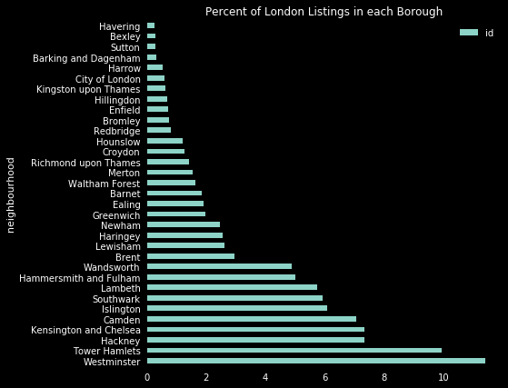


### How has the overall number of listings in London changed over time

Since we don't have the actual date the listing was first put up, we can use "first review" as a proxy for when it first showed up.


```python
listings.groupby([listings['first review']]).agg({ 'id': len }).plot(grid=False)
plt.title("Growth of AirBnB in London")
plt.show()
```


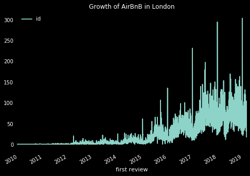


```python
listings['price'].plot(kind='hist', grid=False, bins = 45)

```


    <matplotlib.axes._subplots.AxesSubplot at 0x7fc68533b080>


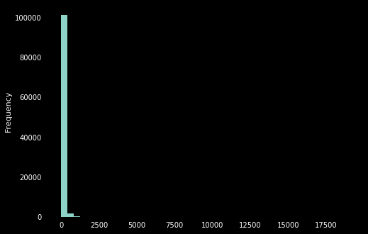


```python
listings['price'].describe()
```


    count    103546.000000
    mean        114.257779
    std         198.485258
    min           0.000000
    25%          45.000000
    50%          80.000000
    75%         130.000000
    max       19000.000000
    Name: price, dtype: float64


# Most Expensive Neighbourhood


```python
xt =listings.pivot_table(index=listings['neighbourhood'], values=['price'], aggfunc=['mean','median','max','min',len ])

#xt.reset_index()
xt.columns = list(map('_'.join, xt.columns.values))
```


```python
# mean price
xt.sort_values(by='mean_price', ascending=False).head(5)
```


<div>
<style scoped>
    .dataframe tbody tr th:only-of-type {
        vertical-align: middle;
    }

    .dataframe tbody tr th {
        vertical-align: top;
    }

    .dataframe thead th {
        text-align: right;
    }
</style>
<table border="1" class="dataframe">
  <thead>
    <tr style="text-align: right;">
      <th></th>
      <th>mean_price</th>
      <th>median_price</th>
      <th>max_price</th>
      <th>min_price</th>
      <th>len_price</th>
    </tr>
    <tr>
      <th>neighbourhood</th>
      <th></th>
      <th></th>
      <th></th>
      <th></th>
      <th></th>
    </tr>
  </thead>
  <tbody>
    <tr>
      <th>Kensington and Chelsea</th>
      <td>201.781991</td>
      <td>140.0</td>
      <td>6950.0</td>
      <td>0.0</td>
      <td>7596.0</td>
    </tr>
    <tr>
      <th>Westminster</th>
      <td>197.603083</td>
      <td>128.0</td>
      <td>19000.0</td>
      <td>0.0</td>
      <td>11806.0</td>
    </tr>
    <tr>
      <th>City of London</th>
      <td>161.786645</td>
      <td>140.5</td>
      <td>1100.0</td>
      <td>20.0</td>
      <td>614.0</td>
    </tr>
    <tr>
      <th>Camden</th>
      <td>133.806782</td>
      <td>100.0</td>
      <td>7000.0</td>
      <td>0.0</td>
      <td>7313.0</td>
    </tr>
    <tr>
      <th>Hammersmith and Fulham</th>
      <td>117.723371</td>
      <td>90.0</td>
      <td>6560.0</td>
      <td>0.0</td>
      <td>5173.0</td>
    </tr>
  </tbody>
</table>
</div>


```python
# median price
xt.sort_values(by='median_price', ascending=False).head(5)
```


<div>
<style scoped>
    .dataframe tbody tr th:only-of-type {
        vertical-align: middle;
    }

    .dataframe tbody tr th {
        vertical-align: top;
    }

    .dataframe thead th {
        text-align: right;
    }
</style>
<table border="1" class="dataframe">
  <thead>
    <tr style="text-align: right;">
      <th></th>
      <th>mean_price</th>
      <th>median_price</th>
      <th>max_price</th>
      <th>min_price</th>
      <th>len_price</th>
    </tr>
    <tr>
      <th>neighbourhood</th>
      <th></th>
      <th></th>
      <th></th>
      <th></th>
      <th></th>
    </tr>
  </thead>
  <tbody>
    <tr>
      <th>City of London</th>
      <td>161.786645</td>
      <td>140.5</td>
      <td>1100.0</td>
      <td>20.0</td>
      <td>614.0</td>
    </tr>
    <tr>
      <th>Kensington and Chelsea</th>
      <td>201.781991</td>
      <td>140.0</td>
      <td>6950.0</td>
      <td>0.0</td>
      <td>7596.0</td>
    </tr>
    <tr>
      <th>Westminster</th>
      <td>197.603083</td>
      <td>128.0</td>
      <td>19000.0</td>
      <td>0.0</td>
      <td>11806.0</td>
    </tr>
    <tr>
      <th>Camden</th>
      <td>133.806782</td>
      <td>100.0</td>
      <td>7000.0</td>
      <td>0.0</td>
      <td>7313.0</td>
    </tr>
    <tr>
      <th>Hammersmith and Fulham</th>
      <td>117.723371</td>
      <td>90.0</td>
      <td>6560.0</td>
      <td>0.0</td>
      <td>5173.0</td>
    </tr>
  </tbody>
</table>
</div>


```python
#most expensive
xt.sort_values(by='max_price', ascending=False).head(5)
```


<div>
<style scoped>
    .dataframe tbody tr th:only-of-type {
        vertical-align: middle;
    }

    .dataframe tbody tr th {
        vertical-align: top;
    }

    .dataframe thead th {
        text-align: right;
    }
</style>
<table border="1" class="dataframe">
  <thead>
    <tr style="text-align: right;">
      <th></th>
      <th>mean_price</th>
      <th>median_price</th>
      <th>max_price</th>
      <th>min_price</th>
      <th>len_price</th>
    </tr>
    <tr>
      <th>neighbourhood</th>
      <th></th>
      <th></th>
      <th></th>
      <th></th>
      <th></th>
    </tr>
  </thead>
  <tbody>
    <tr>
      <th>Westminster</th>
      <td>197.603083</td>
      <td>128.0</td>
      <td>19000.0</td>
      <td>0.0</td>
      <td>11806.0</td>
    </tr>
    <tr>
      <th>Southwark</th>
      <td>100.119655</td>
      <td>75.0</td>
      <td>9999.0</td>
      <td>0.0</td>
      <td>6151.0</td>
    </tr>
    <tr>
      <th>Wandsworth</th>
      <td>113.647489</td>
      <td>80.0</td>
      <td>7175.0</td>
      <td>0.0</td>
      <td>5058.0</td>
    </tr>
    <tr>
      <th>Merton</th>
      <td>102.824155</td>
      <td>64.5</td>
      <td>7000.0</td>
      <td>7.0</td>
      <td>1598.0</td>
    </tr>
    <tr>
      <th>Camden</th>
      <td>133.806782</td>
      <td>100.0</td>
      <td>7000.0</td>
      <td>0.0</td>
      <td>7313.0</td>
    </tr>
  </tbody>
</table>
</div>


```python
# cheapest neighbourhood
xt.sort_values(by='min_price', ascending=False).head(5)
```


<div>
<style scoped>
    .dataframe tbody tr th:only-of-type {
        vertical-align: middle;
    }

    .dataframe tbody tr th {
        vertical-align: top;
    }

    .dataframe thead th {
        text-align: right;
    }
</style>
<table border="1" class="dataframe">
  <thead>
    <tr style="text-align: right;">
      <th></th>
      <th>mean_price</th>
      <th>median_price</th>
      <th>max_price</th>
      <th>min_price</th>
      <th>len_price</th>
    </tr>
    <tr>
      <th>neighbourhood</th>
      <th></th>
      <th></th>
      <th></th>
      <th></th>
      <th></th>
    </tr>
  </thead>
  <tbody>
    <tr>
      <th>City of London</th>
      <td>161.786645</td>
      <td>140.5</td>
      <td>1100.0</td>
      <td>20.0</td>
      <td>614.0</td>
    </tr>
    <tr>
      <th>Kingston upon Thames</th>
      <td>74.220820</td>
      <td>52.0</td>
      <td>700.0</td>
      <td>14.0</td>
      <td>634.0</td>
    </tr>
    <tr>
      <th>Enfield</th>
      <td>70.352459</td>
      <td>49.0</td>
      <td>6000.0</td>
      <td>14.0</td>
      <td>732.0</td>
    </tr>
    <tr>
      <th>Richmond upon Thames</th>
      <td>117.063599</td>
      <td>85.0</td>
      <td>1500.0</td>
      <td>13.0</td>
      <td>1478.0</td>
    </tr>
    <tr>
      <th>Sutton</th>
      <td>57.788274</td>
      <td>45.0</td>
      <td>676.0</td>
      <td>12.0</td>
      <td>307.0</td>
    </tr>
  </tbody>
</table>
</div>


```python
#Cheapest median
xt.sort_values(by='median_price', ascending=True).head(5)
```


<div>
<style scoped>
    .dataframe tbody tr th:only-of-type {
        vertical-align: middle;
    }

    .dataframe tbody tr th {
        vertical-align: top;
    }

    .dataframe thead th {
        text-align: right;
    }
</style>
<table border="1" class="dataframe">
  <thead>
    <tr style="text-align: right;">
      <th></th>
      <th>mean_price</th>
      <th>median_price</th>
      <th>max_price</th>
      <th>min_price</th>
      <th>len_price</th>
    </tr>
    <tr>
      <th>neighbourhood</th>
      <th></th>
      <th></th>
      <th></th>
      <th></th>
      <th></th>
    </tr>
  </thead>
  <tbody>
    <tr>
      <th>Barking and Dagenham</th>
      <td>61.378299</td>
      <td>40.0</td>
      <td>746.0</td>
      <td>10.0</td>
      <td>341.0</td>
    </tr>
    <tr>
      <th>Bexley</th>
      <td>55.594059</td>
      <td>40.0</td>
      <td>500.0</td>
      <td>11.0</td>
      <td>303.0</td>
    </tr>
    <tr>
      <th>Croydon</th>
      <td>58.703506</td>
      <td>42.0</td>
      <td>850.0</td>
      <td>7.0</td>
      <td>1312.0</td>
    </tr>
    <tr>
      <th>Sutton</th>
      <td>57.788274</td>
      <td>45.0</td>
      <td>676.0</td>
      <td>12.0</td>
      <td>307.0</td>
    </tr>
    <tr>
      <th>Redbridge</th>
      <td>63.054374</td>
      <td>45.0</td>
      <td>699.0</td>
      <td>11.0</td>
      <td>846.0</td>
    </tr>
  </tbody>
</table>
</div>


```python
#Cheapest by mean
xt.sort_values(by='mean_price', ascending=True).head(5)
```


<div>
<style scoped>
    .dataframe tbody tr th:only-of-type {
        vertical-align: middle;
    }

    .dataframe tbody tr th {
        vertical-align: top;
    }

    .dataframe thead th {
        text-align: right;
    }
</style>
<table border="1" class="dataframe">
  <thead>
    <tr style="text-align: right;">
      <th></th>
      <th>mean_price</th>
      <th>median_price</th>
      <th>max_price</th>
      <th>min_price</th>
      <th>len_price</th>
    </tr>
    <tr>
      <th>neighbourhood</th>
      <th></th>
      <th></th>
      <th></th>
      <th></th>
      <th></th>
    </tr>
  </thead>
  <tbody>
    <tr>
      <th>Bexley</th>
      <td>55.594059</td>
      <td>40.0</td>
      <td>500.0</td>
      <td>11.0</td>
      <td>303.0</td>
    </tr>
    <tr>
      <th>Sutton</th>
      <td>57.788274</td>
      <td>45.0</td>
      <td>676.0</td>
      <td>12.0</td>
      <td>307.0</td>
    </tr>
    <tr>
      <th>Croydon</th>
      <td>58.703506</td>
      <td>42.0</td>
      <td>850.0</td>
      <td>7.0</td>
      <td>1312.0</td>
    </tr>
    <tr>
      <th>Barking and Dagenham</th>
      <td>61.378299</td>
      <td>40.0</td>
      <td>746.0</td>
      <td>10.0</td>
      <td>341.0</td>
    </tr>
    <tr>
      <th>Redbridge</th>
      <td>63.054374</td>
      <td>45.0</td>
      <td>699.0</td>
      <td>11.0</td>
      <td>846.0</td>
    </tr>
  </tbody>
</table>
</div>


```python

listings.pivot_table(index=['neighbourhood'], values=['price'], aggfunc=['mean','median']).plot(kind='barh', figsize=(10,10),grid=False)
```


    <matplotlib.axes._subplots.AxesSubplot at 0x7fc66cebca58>


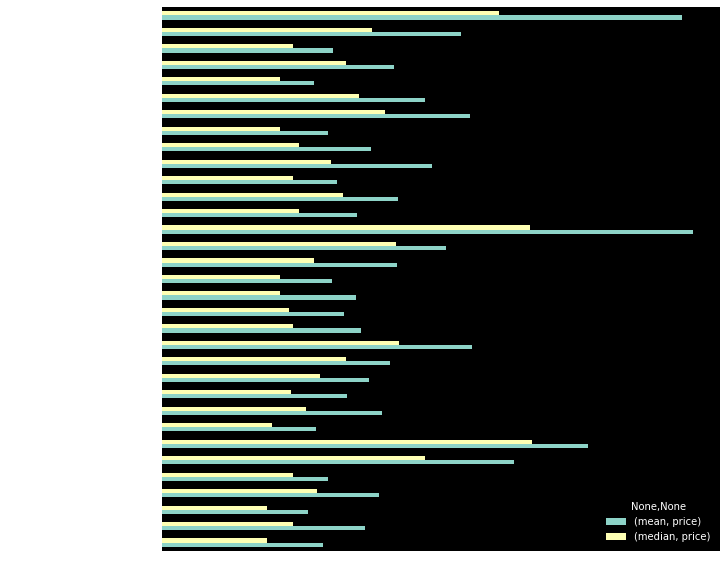


## Year Over Year Changes for London Bourough prices


```python
#creating a pivot table
yoy_pivot =  listings.pivot_table(index= listings['first review'].dt.year, columns = 'neighbourhood', values= 'price')
changes = yoy_pivot.pct_change().reset_index() #calculating the change from year to year

#New column to track the average change per year
changes['ave_changes'] = changes.iloc[:,1::].mean(axis=1)

#melting the data frame  with three columns 
changes_melt = pd.melt(changes, id_vars='first review',
                       value_vars=changes.columns[1:-1],
                       value_name='YoY Change',
                       var_name ='neighbourhood')

plt.figure(figsize=(10,12)) #plot figure settings
plt.title('Year on Year change  price change for individual')

#plotting a barplot
sns.barplot(y='neighbourhood', x='YoY Change',hue='first review',palette='husl', 
            data=changes_melt[changes_melt['first review']>= 2017],ci=None)

plt.show()
```


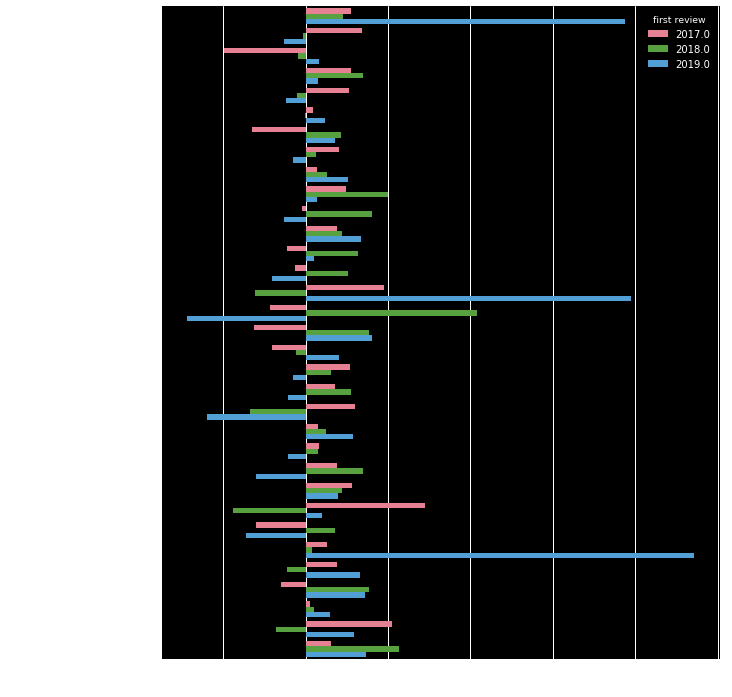


#### House price distribution accross London 


```python
listings.plot(kind='scatter', x= 'longitude', y= 'latitude', alpha=0.9,
            s=listings['price']/200, label='Price',c='price',cmap=plt.get_cmap('coolwarm_r'), style='fivethirtyeight', colorbar=True, figsize=(10,7), grid=False)

#plt.style.use('fivethirtyeight')
plt.legend()
plt.title('AIR_BNB HOUSE PRICE DISTRIBUTION ACROSS LONDON')
```


    Text(0.5,1,'AIR_BNB HOUSE PRICE DISTRIBUTION ACROSS LONDON')


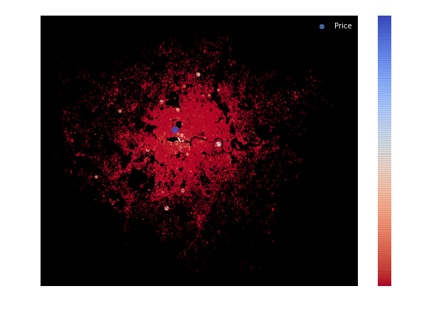


```python
g = sns.catplot(y='neighbourhood', 
                x='price', 
                data=listings, height=8, aspect=1.2)
 
# Rotate x-axis labels
g.set_xticklabels(rotation=-90)
```


    <seaborn.axisgrid.FacetGrid at 0x7fc66c01f7f0>


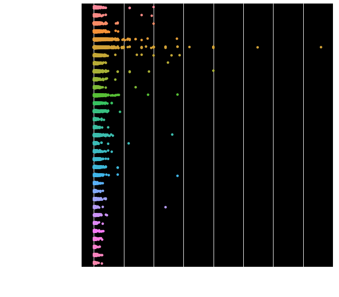


We need to find a few fetaures to focus on from here, we can use calculate the correlation of the whole dataset with the target feature.
We Know the target feature has wild outliers so we shall be using a method less sensitive to outliers when calculating the correlations.


```python
corr_matrix = listings.corr(method='spearman').fillna('median')
sns.heatmap(corr_matrix)
```


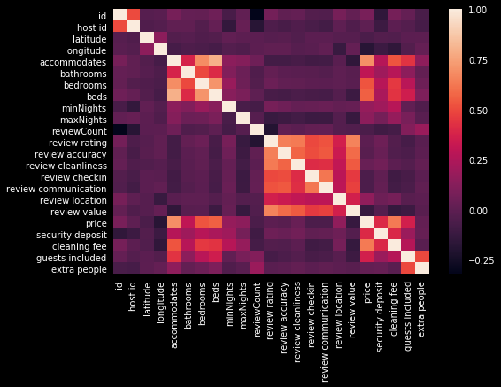


```python
corr_matrix['price'].sort_values(ascending= False).head()
```


    price           1.000000
    accommodates    0.691085
    cleaning fee    0.629125
    beds            0.560130
    bedrooms        0.530984
    Name: price, dtype: float64


```python
from pandas.plotting import scatter_matrix

attributes = ["accommodates", "price", "bedrooms",
              "beds", 'cleaning fee' ]
scatter_matrix(listings[attributes], figsize=(12, 8))
print('..')
```

    ..
    


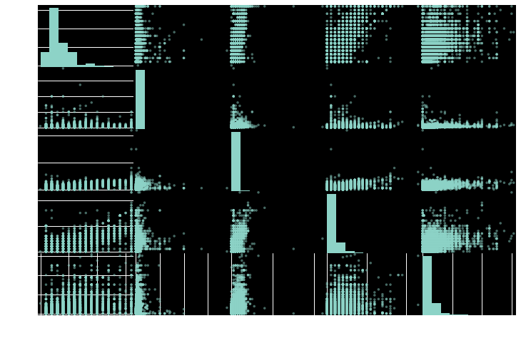


```python
#number of listings where price is equal to zero

Number_of_zero_price =len(listings[listings['price'] == 0])
Percetage_Zero_price =(len(listings[listings['price'] == 0])/len(listings))*100


print(f'Number_of_zero_price: {Number_of_zero_price}')
print(f'Percetage_Zero_price: {Percetage_Zero_price :.2f}')
```

    Number_of_zero_price: 71
    Percetage_Zero_price: 0.07
    


```python
listings.groupby('neighbourhood')['price','review location'].mean().sort_values(by='price',ascending= False).head(5)
#plt.title("Growth of AirBnB in London")
#plt.show()
```


<div>
<style scoped>
    .dataframe tbody tr th:only-of-type {
        vertical-align: middle;
    }

    .dataframe tbody tr th {
        vertical-align: top;
    }

    .dataframe thead th {
        text-align: right;
    }
</style>
<table border="1" class="dataframe">
  <thead>
    <tr style="text-align: right;">
      <th></th>
      <th>price</th>
      <th>review location</th>
    </tr>
    <tr>
      <th>neighbourhood</th>
      <th></th>
      <th></th>
    </tr>
  </thead>
  <tbody>
    <tr>
      <th>Kensington and Chelsea</th>
      <td>201.781991</td>
      <td>9.716339</td>
    </tr>
    <tr>
      <th>Westminster</th>
      <td>197.603083</td>
      <td>9.700820</td>
    </tr>
    <tr>
      <th>City of London</th>
      <td>161.786645</td>
      <td>9.672897</td>
    </tr>
    <tr>
      <th>Camden</th>
      <td>133.806782</td>
      <td>9.687250</td>
    </tr>
    <tr>
      <th>Hammersmith and Fulham</th>
      <td>117.723371</td>
      <td>9.477352</td>
    </tr>
  </tbody>
</table>
</div>


```python
listings.groupby('neighbourhood')['price','review location'].median().sort_values(by='price',ascending= False).head(5)
#plt.title("Growth of AirBnB in London")
#plt.show()
```


<div>
<style scoped>
    .dataframe tbody tr th:only-of-type {
        vertical-align: middle;
    }

    .dataframe tbody tr th {
        vertical-align: top;
    }

    .dataframe thead th {
        text-align: right;
    }
</style>
<table border="1" class="dataframe">
  <thead>
    <tr style="text-align: right;">
      <th></th>
      <th>price</th>
      <th>review location</th>
    </tr>
    <tr>
      <th>neighbourhood</th>
      <th></th>
      <th></th>
    </tr>
  </thead>
  <tbody>
    <tr>
      <th>City of London</th>
      <td>140.5</td>
      <td>10.0</td>
    </tr>
    <tr>
      <th>Kensington and Chelsea</th>
      <td>140.0</td>
      <td>10.0</td>
    </tr>
    <tr>
      <th>Westminster</th>
      <td>128.0</td>
      <td>10.0</td>
    </tr>
    <tr>
      <th>Camden</th>
      <td>100.0</td>
      <td>10.0</td>
    </tr>
    <tr>
      <th>Hammersmith and Fulham</th>
      <td>90.0</td>
      <td>10.0</td>
    </tr>
  </tbody>
</table>
</div>


## Merging tables

We can solve some more interesting problems if we merge a few tables together. Let's see how review sentitment correlates with a listings overall ratings.

The reviews table contains a simplified summary of the reviews left for each property by month, characterised by a sentiment score and a word count.


```python
reviews = pd.read_csv(os.path.join(path,"Reviews.csv"))
reviews.head()
```


<div>
<style scoped>
    .dataframe tbody tr th:only-of-type {
        vertical-align: middle;
    }

    .dataframe tbody tr th {
        vertical-align: top;
    }

    .dataframe thead th {
        text-align: right;
    }
</style>
<table border="1" class="dataframe">
  <thead>
    <tr style="text-align: right;">
      <th></th>
      <th>listing id</th>
      <th>mon_yr</th>
      <th>reviewerCount</th>
      <th>avgSentiment</th>
      <th>avgWordcount</th>
      <th>neighbourhood</th>
    </tr>
  </thead>
  <tbody>
    <tr>
      <th>0</th>
      <td>9554</td>
      <td>01-2013</td>
      <td>2</td>
      <td>0.093655</td>
      <td>48.50</td>
      <td>Haringey</td>
    </tr>
    <tr>
      <th>1</th>
      <td>9554</td>
      <td>01-2016</td>
      <td>2</td>
      <td>0.315268</td>
      <td>56.50</td>
      <td>Haringey</td>
    </tr>
    <tr>
      <th>2</th>
      <td>9554</td>
      <td>01-2017</td>
      <td>1</td>
      <td>1.000000</td>
      <td>1.00</td>
      <td>Haringey</td>
    </tr>
    <tr>
      <th>3</th>
      <td>9554</td>
      <td>01-2018</td>
      <td>1</td>
      <td>0.000000</td>
      <td>1.00</td>
      <td>Haringey</td>
    </tr>
    <tr>
      <th>4</th>
      <td>9554</td>
      <td>02-2013</td>
      <td>4</td>
      <td>0.250000</td>
      <td>28.25</td>
      <td>Haringey</td>
    </tr>
  </tbody>
</table>
</div>


```python
reviews.hist(bins = 50, figsize= (10,7), grid=False)
#plt.grid(False)
plt.show()
```


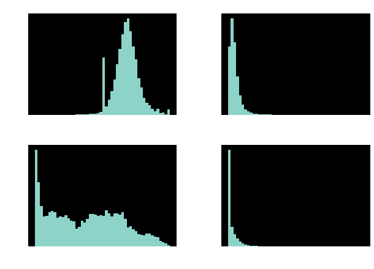


Arguably the simplest visualisation of a single column is the histogram - group the data into bins and plot the number in each bin. Plotted this way, it is clear that most reviews are positive, though not overwhelmingly so:


```python
reviews['avgSentiment'].hist(bins = np.linspace(-1, 1, 100))
plt.xlabel('Average sentiment score')
plt.ylabel('Count')
plt.grid(False)
plt.show()
```


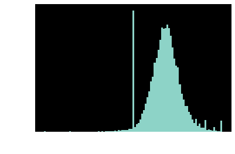


Most reviews tend to be pretty short too, around 40 words long:


```python
reviews['avgWordcount'].hist(bins = np.linspace(0, 300, 100))
plt.xlabel('Average word count')
plt.ylabel('Count')
plt.grid(False)
plt.show()
```


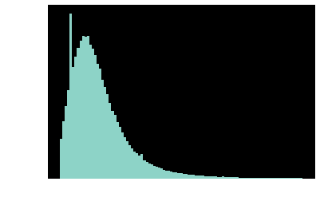


For now let's just take the median sentiment for each listing, so that the following table is *uniquely keyed* on the `listing id`, i.e. there is only one value for each `listing id`.


```python
med_rvw = reviews.groupby('listing id')['avgSentiment'].median().reset_index()
med_rvw.head()
```


<div>
<style scoped>
    .dataframe tbody tr th:only-of-type {
        vertical-align: middle;
    }

    .dataframe tbody tr th {
        vertical-align: top;
    }

    .dataframe thead th {
        text-align: right;
    }
</style>
<table border="1" class="dataframe">
  <thead>
    <tr style="text-align: right;">
      <th></th>
      <th>listing id</th>
      <th>avgSentiment</th>
    </tr>
  </thead>
  <tbody>
    <tr>
      <th>0</th>
      <td>9554</td>
      <td>0.376970</td>
    </tr>
    <tr>
      <th>1</th>
      <td>11076</td>
      <td>0.727500</td>
    </tr>
    <tr>
      <th>2</th>
      <td>11417</td>
      <td>0.272692</td>
    </tr>
    <tr>
      <th>3</th>
      <td>13913</td>
      <td>0.337118</td>
    </tr>
    <tr>
      <th>4</th>
      <td>15400</td>
      <td>0.394443</td>
    </tr>
  </tbody>
</table>
</div>


In this form, we are able to merge the `med_rvw` table onto the `listings` table. Merging is where we take two tables - a `left` and a `right`, and attach the `right` table onto the `left` table.

To match up the rows in the attached tables, pandas needs to know how to indentify each row - in this case we can use the id of each airbnb listing. This column is called `listing id` in `med_rvw`, and `id` in listings.

In the following cell, we extract the columns from `listings` we are interested in, and then call the `merge()` method. In this case, `left` is `listings` and `right` is `med_rvw`.


```python
cols_to_keep = ['id','review rating','review accuracy', 'review cleanliness', 'review checkin',
                'review communication', 'review location', 'review value', 'neighbourhood']

merged = listings[cols_to_keep].merge(med_rvw, left_on = 'id', right_on = 'listing id', how = 'inner')
merged.head()
```


<div>
<style scoped>
    .dataframe tbody tr th:only-of-type {
        vertical-align: middle;
    }

    .dataframe tbody tr th {
        vertical-align: top;
    }

    .dataframe thead th {
        text-align: right;
    }
</style>
<table border="1" class="dataframe">
  <thead>
    <tr style="text-align: right;">
      <th></th>
      <th>id</th>
      <th>review rating</th>
      <th>review accuracy</th>
      <th>review cleanliness</th>
      <th>review checkin</th>
      <th>review communication</th>
      <th>review location</th>
      <th>review value</th>
      <th>neighbourhood</th>
      <th>listing id</th>
      <th>avgSentiment</th>
    </tr>
  </thead>
  <tbody>
    <tr>
      <th>0</th>
      <td>9554</td>
      <td>97.0</td>
      <td>10.0</td>
      <td>9.0</td>
      <td>10.0</td>
      <td>10.0</td>
      <td>9.0</td>
      <td>10.0</td>
      <td>Haringey</td>
      <td>9554</td>
      <td>0.376970</td>
    </tr>
    <tr>
      <th>1</th>
      <td>11076</td>
      <td>90.0</td>
      <td>8.0</td>
      <td>9.0</td>
      <td>10.0</td>
      <td>9.0</td>
      <td>9.0</td>
      <td>9.0</td>
      <td>Ealing</td>
      <td>11076</td>
      <td>0.727500</td>
    </tr>
    <tr>
      <th>2</th>
      <td>11417</td>
      <td>95.0</td>
      <td>10.0</td>
      <td>10.0</td>
      <td>10.0</td>
      <td>10.0</td>
      <td>10.0</td>
      <td>9.0</td>
      <td>Tower Hamlets</td>
      <td>11417</td>
      <td>0.272692</td>
    </tr>
    <tr>
      <th>3</th>
      <td>13913</td>
      <td>95.0</td>
      <td>9.0</td>
      <td>10.0</td>
      <td>9.0</td>
      <td>10.0</td>
      <td>9.0</td>
      <td>9.0</td>
      <td>Islington</td>
      <td>13913</td>
      <td>0.337118</td>
    </tr>
    <tr>
      <th>4</th>
      <td>15400</td>
      <td>95.0</td>
      <td>10.0</td>
      <td>10.0</td>
      <td>10.0</td>
      <td>10.0</td>
      <td>10.0</td>
      <td>9.0</td>
      <td>Kensington and Chelsea</td>
      <td>15400</td>
      <td>0.394443</td>
    </tr>
  </tbody>
</table>
</div>


Now everything is matched up in one table, we can do fun things like look at the relationship between the actual review rating, and the sentiment of the review text:


```python
x = merged['review rating']
y = merged['avgSentiment']
# Drop pairs of (x, y) if either is NaN
x, y = list(zip(*[(x[i], y[i]) for i in range(len(x)) if np.isfinite(x[i]) and np.isfinite(y[i])]))

plt.plot(x, y, 'o')
plt.title("Review Rating vs Review Sentiment")
plt.xlabel('Review rating')
plt.ylabel('Review sentiment')
plt.grid(False)
plt.show()
```


As there are lots of points and they all overlap, often a better way of plotting dense data is to create a 2D histogram and plot the density of points. In this way we see better the overrepresentation of review ratings at 20 / 40 / 60 / 80 / 100%, and review sentiments of zero.


```python
xbins = np.linspace(10, 110, 100)
ybins = np.linspace(-1, 1, 100)
hist2d, xe, ye = np.histogram2d(x,y, bins=(xbins, ybins))
plt.pcolormesh(xe[1:], ye[1:], np.log(hist2d.T + 0.1),cmap=plt.get_cmap('RdBu')) # Offset to avoid log(0)
plt.xlabel('Review rating')
plt.ylabel('Review sentiment')
plt.colorbar(label='log(# reviews)')
plt.show()
```


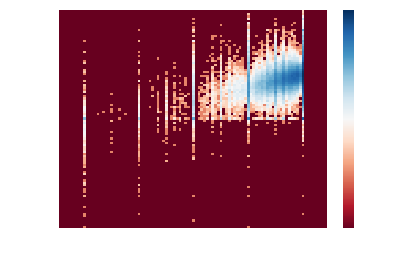


## Challenge: Which borough has the highest average location score? Lowest?


```python
merged.groupby('neighbourhood')['review location'].mean().sort_values(ascending= False).plot('barh',figsize=(10,7))
```


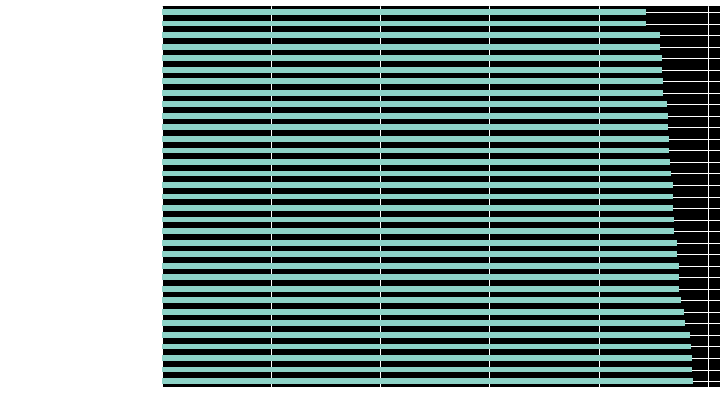


More to come on this analysis...